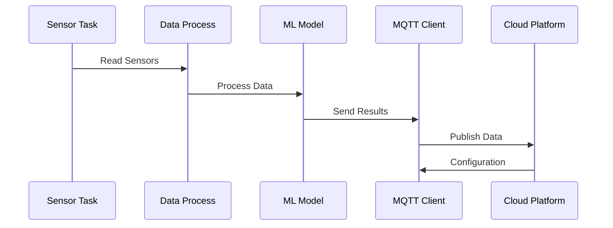
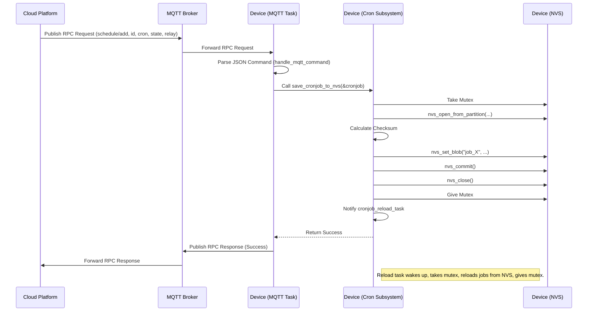
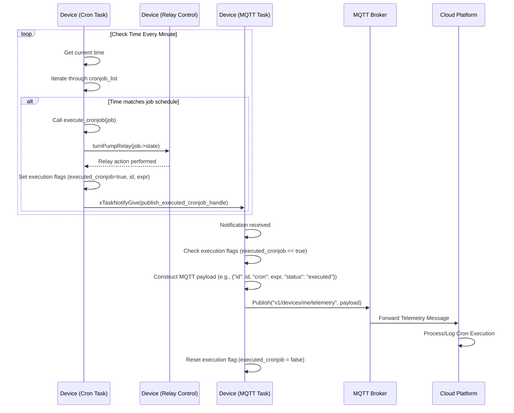
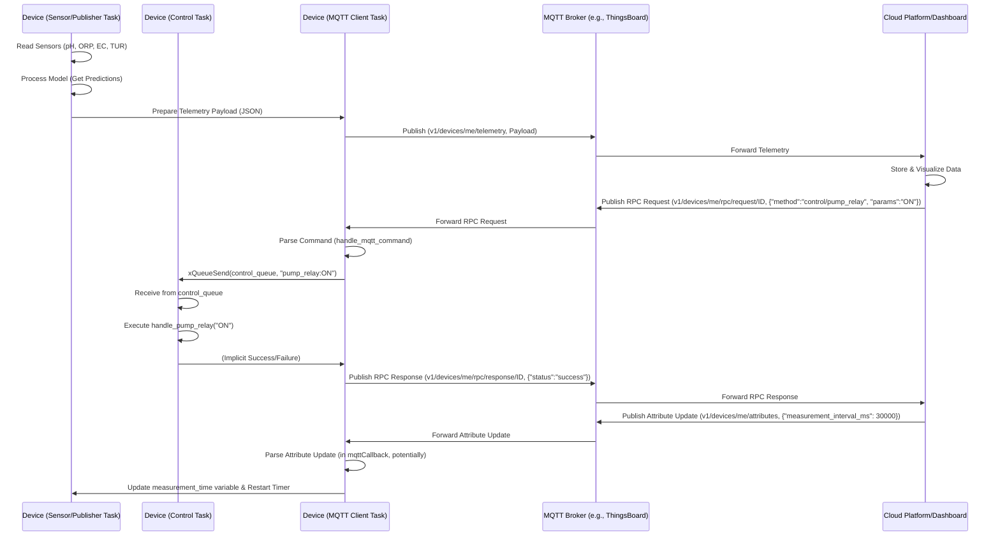
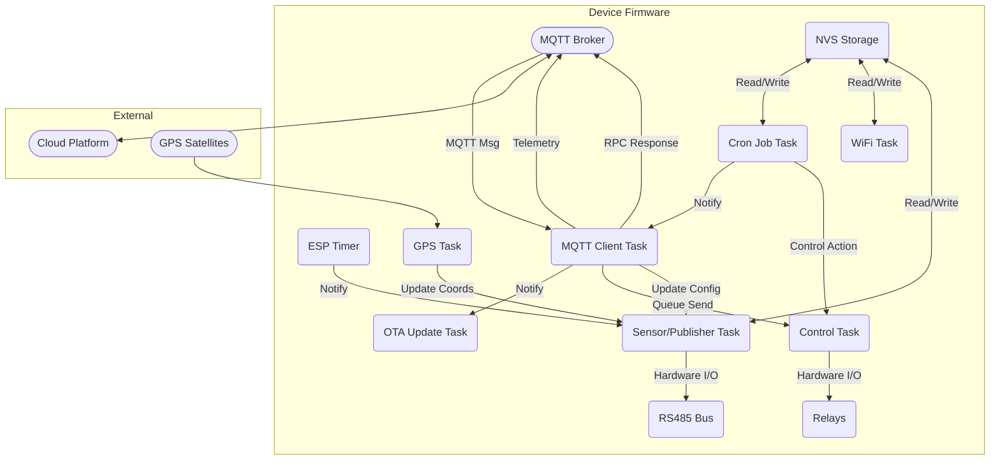
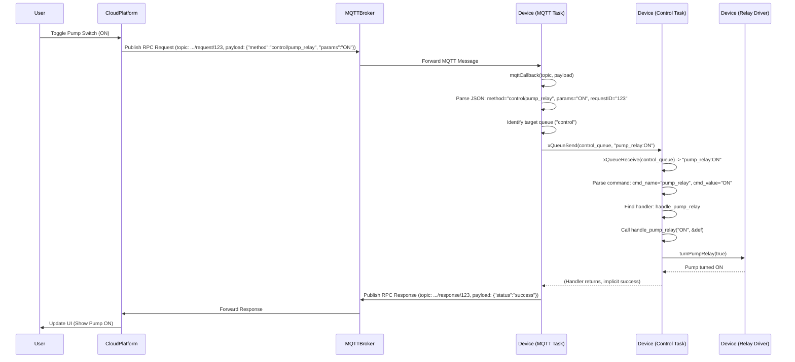

# Seawater Quality Monitoring System

## Abstract

This research project presents a comprehensive embedded system for real-time seawater quality monitoring and management. The system utilizes the M5Station485 platform equipped with multiple sensors to measure critical water quality parameters including pH, ORP (Oxidation-Reduction Potential), EC (Electrical Conductivity), and turbidity. The research incorporates machine learning algorithms to predict water quality degradation, and implements automated control mechanisms for water treatment processes. This document outlines the theoretical background, system architecture, and key technological innovations employed in this thesis project.

## Theoretical Background

### Embedded Systems for Environmental Monitoring

Environmental monitoring through embedded systems represents a critical area of applied science that combines electronics, computer science, and environmental engineering. Such systems enable continuous, automated data collection in natural environments, providing insights that would be impractical to obtain through manual sampling. The reliability and autonomy of these systems are particularly valuable for aquatic environments where conditions can change rapidly and unexpectedly.

### Water Quality Parameters

The system monitors four critical parameters that collectively provide a comprehensive assessment of seawater quality:

1. **pH**: A logarithmic measure of hydrogen ion concentration that indicates the acidity or alkalinity of water. In seawater, pH typically ranges from 7.5 to 8.4, with values outside this range potentially indicating pollution or biological imbalances.

2. **ORP (Oxidation-Reduction Potential)**: Measured in millivolts, ORP indicates the water's capacity to oxidize or reduce substances. It serves as an indicator of the water's ability to break down contaminants and support biological processes.

3. **EC (Electrical Conductivity)**: Measured in microsiemens per centimeter (μS/cm), EC reflects the concentration of dissolved ions in water. In seawater applications, EC helps monitor salinity levels and detect potential freshwater intrusion.

4. **Turbidity**: Measured in NTU (Nephelometric Turbidity Units), turbidity indicates the clarity of water by measuring scattered light through suspended particles. Elevated turbidity can signal increased sediment, algal growth, or pollutants.

### Predictive Analytics in Water Quality Management

The application of machine learning for predictive analytics in water quality management represents an emerging field with significant potential benefits. By analyzing temporal patterns in water quality parameters, predictive models can identify deterioration trends before they reach critical levels, enabling preemptive intervention.

## System Architecture

### Hardware Platform

The M5Station485 serves as the core hardware platform, offering:
- ESP32-based microcontroller with dual-core processing capabilities
- Native RS-485 communication for industrial sensor interfaces
- Integrated power management for battery and solar operation
- Robust I/O capabilities including digital and analog interfaces

### Software Architecture

The software architecture employs a modular, task-based approach using FreeRTOS as the underlying real-time operating system. Major system components include:

1. **Sensor Interface Layer**: Manages communication with RS-485 water quality sensors
2. **Data Processing Layer**: Handles raw data validation, calibration, and preparation for analysis
3. **Machine Learning Inference Engine**: Executes the TensorFlow Lite model for predictive analytics
4. **Control System**: Manages automated responses to water quality changes
5. **Communication Layer**: Handles MQTT-based data transmission to cloud platforms
6. **System Management Layer**: Oversees power management, storage, and system health

### System Architecture Diagram

```
                   ┌─────────────────────────┐
                   │   Seawater Quality      │
                   │   Monitoring System     │
                   └───────────┬─────────────┘
                               │
           ┌─────────────────┬─┴───────────┬────────────────┐
           │                 │             │                │
┌──────────▼───────┐ ┌───────▼───────┐ ┌───▼───────────┐ ┌──▼─────────────┐
│    Sensor        │ │  Processing   │ │ Communication │ │   Control      │
│    Subsystem     │ │  Subsystem    │ │  Subsystem    │ │   Subsystem    │
└──────────┬───────┘ └──────┬────────┘ └──┬────────────┘ └──┬─────────────┘
           │                │             │                 │
┌──────────▼───────┐ ┌──────▼────────┐ ┌──▼───────────┐ ┌───▼────────────┐
│ - pH Sensor      │ │ - Data        │ │ - WiFi       │ │ - Pump Relay   │
│ - ORP Sensor     │ │   Validation  │ │ - MQTT       │ │   Control      │
│ - EC Sensor      │ │ - TensorFlow  │ │   Telemetry  │ │ - Alarm System │
│ - Turbidity      │ │   Lite Model  │ │ - OTA        │ │ - Cron-based   │
│   Sensor         │ │ - NVS Storage │ │   Updates    │ │   Scheduling   │
└──────────────────┘ └───────────────┘ └──────────────┘ └────────────────┘
           │                │             │                │
           └────────────────┼─────────────┼────────────────┘
                            │             │
                     ┌──────▼─────────────▼──────┐
                     │    FreeRTOS Task          │
                     │   Management & Scheduling │
                     └───────────────────────────┘
```

### Software Layer Architecture

```
┌────────────────────────────────────┐
│        Application Layer           │
│  (Web UI, Control, Analytics)      │
└──────────────┬─────────────────────┘
               │
┌──────────────▼─────────────────────┐
│        Communication Layer         │
│  (MQTT, WiFi, OTA Updates)         │
└──────────────┬─────────────────────┘
               │
┌──────────────▼─────────────────────┐
│         Processing Layer           │
│  (Data Analysis, ML, Scheduling)   │
└──────────────┬─────────────────────┘
               │
┌──────────────▼─────────────────────┐
│         Data Access Layer          │
│  (NVS, SPIFFS, Sensor Buffers)     │
└──────────────┬─────────────────────┘
               │
┌──────────────▼─────────────────────┐
│       Hardware Access Layer        │
│  (RS485, GPIO, I2C/SPI)            │
└──────────────┬─────────────────────┘
               │
         ┌─────▼─────┐
         │  Hardware │
         └───────────┘
```

## Key Technologies

### Flash Memory Partition Architecture

The system implements a sophisticated partition scheme that forms the foundation for reliable operation and update capabilities. The partition layout follows a hierarchical organization that segregates code from data while enabling robust update mechanisms:

```
# Name,    Type, SubType, Offset,   Size,    Flags
nvs,       data, nvs,      0x9000,   0x3000
otadata,   data, ota,            ,   0x2000
phy_init,  data, phy,            ,   0x1000
factory,   app,  factory,        ,   2M
ota_0,     app,  ota_0,          ,   2M
ota_1,     app,  ota_1,          ,   2M
nvs_data,  data, nvs,            ,   0x31000
spiffs,    data, spiffs,         ,   1M
```

#### Partition Structure Visualization

```
┌───────────────────────────────────────────────────┐
│               ESP32 Flash Memory                  │
├───────────┬───────────┬───────────┬───────────────┤
│  Boot     │ Partition │  App 0    │    App 1      │
│  Loader   │  Table    │ (Active)  │   (Update)    │
├───────────┴───────────┼───────────┼───────────────┤
│       0x1000          │  0x10000  │   0x150000    │
└───────────────────────┴───────────┴───────────────┘

┌───────────────────────────┬────────────────────────┐
│     Data Partitions       │    Size and Purpose    │
├───────────────────────────┼────────────────────────┤
│ nvs (system config)       │  0x3000  (12KB)        │
│ otadata (update metadata) │  0x2000  (8KB)         │
│ phy_init (WiFi calib)     │  0x1000  (4KB)         │
│ factory (initial firmware)│  2MB                   │
│ ota_0 (update slot A)     │  2MB                   │
│ ota_1 (update slot B)     │  2MB                   │
│ nvs_data (app data)       │  0x31000 (196KB)       │
│ spiffs (file system)      │  1MB                   │
└───────────────────────────┴────────────────────────┘
```

#### Dual-Bank OTA Implementation

The partition scheme implements a sophisticated dual-bank OTA (Over-The-Air) update mechanism based on the A/B update pattern. This architecture provides several critical advantages:

1. **Atomic Updates**: The system writes new firmware to the inactive partition (either ota_0 or ota_1) while continuing to run from the active partition. This approach eliminates the risk of interruption during the update process.

2. **Fallback Mechanism**: The otadata partition maintains metadata about the currently active partition and update attempt status. If a newly updated firmware fails to boot properly, the system can automatically revert to the previous functional version.

3. **Verification Before Commitment**: After downloading a firmware update, but before making it the boot partition, the system verifies its integrity through cryptographic checksums and basic functionality checks.

4. **Update Resilience**: Power failures or connectivity interruptions during updates will not compromise the system, as the currently running firmware remains intact until the update is fully verified.

The dual-bank OTA architecture represents a significant advancement over single-bank approaches, where update failures can render devices inoperable and require physical intervention.

#### Memory Allocation Optimization

The partition sizes reflect a careful optimization of scarce flash memory resources:

- **Application Partitions**: Each application partition (factory, ota_0, ota_1) is allocated 2MB, sufficient for the application code, TensorFlow Lite model, and associated libraries.

- **Data Storage Hierarchy**: NVS storage is divided between system configuration (nvs: 12KB) and application data (nvs_data: 196KB), reflecting the different volatility and access patterns of these data types.

- **File System Integration**: The 1MB SPIFFS partition supports storage of web interface assets, configuration files, and cached data, enabling a rich user interface without sacrificing application memory.

This partition architecture represents a crucial design decision that balances competing requirements for code space, data persistence, update safety, and system resilience.

### FreeRTOS Implementation

This project leverages FreeRTOS to create a deterministic, multitasking environment essential for reliable real-time monitoring and control. Key aspects include:

#### Task Scheduling and Priority Visualization

```
┌───────────────────────────────────────────────────────────────┐
│                  FreeRTOS Task Priority Levels                │
├─────────┬───────────────────────────┬─────────────────────────┤
│ Priority│        Task Type          │       Examples          │
├─────────┼───────────────────────────┼─────────────────────────┤
│   10    │ Critical System Tasks     │ OTA Updates             │
│         │ (Highest)                 │ Network Connectivity    │
├─────────┼───────────────────────────┼─────────────────────────┤
│   9     │ Time-Critical Tasks       │ Cron Job Scheduling     │
├─────────┼───────────────────────────┼─────────────────────────┤
│  7-8    │ Core System Tasks         │ Sensor Data Acquisition │
│         │                           │ Error Handling          │
├─────────┼───────────────────────────┼─────────────────────────┤
│  5-6    │ Core Functional Tasks     │ MQTT Communication      │
│         │                           │ Data Processing         │
├─────────┼───────────────────────────┼─────────────────────────┤
│  3-4    │ Background Tasks          │ Status Indication       │
│         │                           │ Data Logging            │
├─────────┼───────────────────────────┼─────────────────────────┤
│  1-2    │ Lowest Priority Tasks     │ Maintenance Operations  │
└─────────┴───────────────────────────┴─────────────────────────┘
```

#### Task Communication Sequence Diagram



This sequence diagram illustrates the flow of data through the system's major components, from sensor reading to cloud processing and configuration feedback. The modular design enables parallel processing of different system aspects while maintaining clear communication pathways between tasks.

### Detailed FreeRTOS Implementation

The Seawater Quality Monitor leverages FreeRTOS's capabilities to create a robust, efficient, and deterministic environment for sensor monitoring and control. This section details the specific FreeRTOS features employed and their significance in the system architecture.

#### Task Management and Scheduling

The system implements a sophisticated multi-task architecture where each major function operates as an independent task with appropriate priority levels:

```
┌──────────────────────────────────────────────────────────────────────────┐
│                    FreeRTOS Task Implementation Details                  │
├─────────────┬─────────┬────────────┬─────────────────────────────────────┤
│ Task Name   │ Priority│ Stack Size │ Function                            │
├─────────────┼─────────┼────────────┼─────────────────────────────────────┤
│connectWiFi  │   10    │   4096B    │ Network connectivity establishment  │
│mqttTask     │    5    │   4096B    │ MQTT protocol communication         │
│publisherTask│    5    │   4096B    │ Data publication to MQTT broker     │
│pubCronTask  │    5    │   4096B    │ Publishing executed cron jobs       │
│otaUpdateTask│   10    │   8192B    │ Over-the-air firmware updates       │
│controlTask  │    5    │   4096B    │ Main system control logic           │
│updateGPS    │    5    │   4096B    │ GPS position acquisition            │
│checkPump    │    2    │   4096B    │ Pump status monitoring              │
└─────────────┴─────────┴────────────┴─────────────────────────────────────┘
```

The architecture employs preemptive scheduling, where higher-priority tasks can interrupt lower-priority ones. This approach ensures that critical operations like network connectivity and OTA updates receive immediate CPU attention, while less time-sensitive tasks like status monitoring yield when necessary.

#### Inter-Task Communication Mechanisms

The system employs multiple FreeRTOS inter-task communication primitives to manage data flow and synchronization:

1. **Event Groups**: Used for signaling system-wide state changes, such as WiFi connectivity status, MQTT connection state, and sensor availability.

2. **Task Notifications**: A lightweight, direct task-to-task signaling mechanism employed for triggering specific actions like initiating an OTA update or executing a scheduled cron job.

3. **Queues**: Implemented for transferring data between tasks while enforcing decoupling. The MQTT publishing system uses queues to buffer sensor readings before transmission.

4. **Semaphores**: 
   - Binary semaphores: Used for simple task synchronization and signaling
   - Counting semaphores: Employed for resource counting (e.g., limiting concurrent sensor operations)
   - Mutex semaphores: Critical for protecting shared resources such as the RS485 bus and NVS storage

#### Memory Management Strategy

The system implements a careful memory management strategy to prevent fragmentation and ensure deterministic behavior:

1. **Static Allocation**: Critical system structures and buffers are statically allocated at compile time, including the TensorFlow Lite tensor arena (20KB) and RS485 communication buffers.

2. **Task Stack Sizing**: Each task's stack size is tailored to its maximum call depth and local variable requirements, with additional margin for runtime variations. The OTA task receives the largest allocation (8192 bytes) due to its complex networking and cryptographic functions.

3. **Heap Management**: The system uses FreeRTOS's heap_4.c implementation, which provides efficient coalescing of free blocks to minimize fragmentation.

#### State Machine Implementation Using Tasks

The control system implements a distributed state machine architecture, where major subsystems operate as independent state machines running in separate FreeRTOS tasks. This approach enhances modularity and resilience:

```
┌───────────────────────────────────────────────────┐
│            Wi-Fi Provisioning State Machine       │
├───────────────────┐                               │
│  PROVISIONING     │◄────────────┐                 │
│  (BLE/SoftAP)     │             │                 │
└────────┬──────────┘             │                 │
         │                        │                 │
         │ Credentials            │ Connection      │
         │ Received               │ Failed          │
         ▼                        │                 │
┌───────────────────┐             │                 │
│     CONNECTING    │─────────────┘                 │
│                   │                               │
└────────┬──────────┘                               │
         │                                          │
         │ Connected                                │
         ▼                                          │
┌───────────────────┐             ┌───────────────┐ │
│    CONNECTED      │───Loss─────►│  RECONNECTING │ │   
│                   │             │               │ │
│───────────────────┘             └───────────────┘ │
└───────────────────────────────────────────────────┘
```

### Non-Volatile Storage (NVS) Architecture

The NVS subsystem provides persistent storage capabilities critical for maintaining system configuration across power cycles and enabling data logging in offline scenarios.

#### NVS Partitioning Strategy

The system implements a dual-partition NVS strategy that separates system configuration from application data:

1. **System NVS (12KB)**: Stores core system parameters:
   - WiFi credentials
   - Device identifiers
   - Calibration constants
   - Boot counters and update status

2. **Application NVS (196KB)**: Stores operational data:
   - Sensor configuration profiles
   - Cron job definitions
   - Historical readings (circular buffer)
   - System state snapshots for recovery

#### NVS Namespace Organization

```
┌───────────────────────────────────────────────────────────────┐
│                   NVS Namespace Architecture                  │
├────────────────┬──────────────────────────────────────────────┤
│ Namespace      │ Purpose and Contents                         │
├────────────────┼──────────────────────────────────────────────┤
│ wifi           │ WiFi SSID, password, connection metrics      │
│ device         │ Device ID, version, hardware configuration   │
│ sensors        │ Calibration constants, operating ranges      │
│ mqtt           │ Broker URLs, credentials, topic templates    │
│ cron_store     │ Scheduled task definitions with checksums    │
│ ml_model       │ Machine learning model parameters            │
│ sys_health     │ Diagnostic data and error logs               │
└────────────────┴──────────────────────────────────────────────┘
```


#### Data Integrity Protection

The NVS implementation incorporates multiple levels of data integrity protection:

1. **Checksum Validation**: Each cron job record includes a checksum field calculated from all other fields, enabling detection of corruption.

2. **Transaction Support**: Critical updates to configuration values utilize the NVS transaction API to ensure atomic updates, preventing half-written states.

3. **Wear Leveling**: The system leverages ESP32's built-in wear leveling to extend flash memory lifespan by distributing writes across the physical memory.

4. **Error Recovery**: When corrupted data is detected, the system implements progressive fallback strategies:
   - Attempt to repair using redundant information
   - Fall back to defaults if repair is impossible
   - Log corruption events for diagnostic purposes

#### NVS Access Sequence Diagram

```
┌─────────┐          ┌─────────┐          ┌─────────┐
│ Task A  │          │  NVS    │          │ Task B  │
└────┬────┘          └────┬────┘          └────┬────┘
     │    Take Mutex      │                    │
     │───────────────────►│                    │
     │                    │                    │
     │    Mutex Acquired  │                    │
     │◄───────────────────│                    │
     │                    │                    │
     │    Read/Write Op   │                    │
     │───────────────────►│                    │
     │                    │                    │
     │    Result          │                    │
     │◄───────────────────│                    │
     │                    │                    │
     │    Release Mutex   │                    │
     │───────────────────►│                    │
     │                    │    Take Mutex      │
     │                    │◄───────────────────│
     │                    │                    │
     │                    │    Mutex Acquired  │
     │                    │───────────────────►│
     │                    │                    │
     │                    │    Read/Write Op   │
     │                    │◄───────────────────│
     │                    │                    │
     │                    │    Result          │
     │                    │───────────────────►│
     │                    │                    │
     │                    │    Release Mutex   │
     │                    │◄───────────────────│
     │                    │                    │
```

### CRON Subsystem Architecture

The system implements a sophisticated cron-based scheduling subsystem that enables autonomous operation and timed interventions based on predefined schedules.

#### Cron Expression Structure

```
┌───────────────────────────────────────────────────────────────┐
│                Cron Expression Syntax                         │
├─────────┬─────────┬──────────┬──────────┬─────────────────────┤
│ Minutes │ Hours   │ Day of   │ Month    │ Day of Week         │
│ (0-59)  │ (0-23)  │ Month    │ (1-12)   │ (0-7, 0 or 7 = Sun) │
│         │         │ (1-31)   │          │                     │
├─────────┼─────────┼──────────┼──────────┼─────────────────────┤
│   *     │    *    │    *     │    *     │         *           │
│ (every  │ (every  │ (every   │ (every   │    (every day       │
│ minute) │  hour)  │  day)    │  month)  │     of week)        │
└─────────┴─────────┴──────────┴──────────┴─────────────────────┘
```

The cron subsystem supports sophisticated expression patterns:
- `*` - matches any value
- `*/n` - matches every n-th value
- `a-b` - matches any value between a and b
- `a,b,c` - matches specific values a, b, and c

#### Cron Job Execution Flow

```
┌─────────────────┐     ┌─────────────────┐     ┌────────────────────┐
│ Time Tracking   │     │  Pattern        │     │   Job Execution    │
│ Subsystem       │     │  Matching       │     │   Subsystem        │
└────────┬────────┘     └────────┬────────┘     └─────────┬──────────┘
         │                       │                        │
         │ Current Time          │                        │
         │───────────────────────┘                        │
         │                       │ Check All Jobs         │
         │                       │ Against Current Time   │
         │                       │                        │
         │                       │ Match Found            │
         │                       │────────────────────────┘
         │                       │                        │
         │                       │                        │ Execute Action
         │                       │                        │ (e.g., turn pump on/off)
         │                       │                        │
         │                       │                        │ Update Status
         │                       │                        │
         │                       │                        │ Notify MQTT
         │                       │                        │
```

### Cron Job Data Structure

Each cron job is represented by a 64-byte structure stored in NVS:

```
┌───────────────────────────────────────────────────────────────────────┐
│                        Cron Job Record Structure                      │
├─────────────┬─────────┬───────────────────────────────────────────────┤
│ Field       │ Size    │ Description                                   │
├─────────────┼─────────┼───────────────────────────────────────────────┤
│ id          │ 4 bytes │ Unique identifier for the job                 │
│ checksum    │ 4 bytes │ Data integrity validation                     │
│ action      │ 24 bytes│ String describing action (add/edit/delete)    │
│ cron        │ 24 bytes│ Cron expression string                        │
│ relay       │ 24 bytes│ Target relay identifier                       │
│ state       │ 1 byte  │ Desired relay state (on/off)                  │
└─────────────┴─────────┴───────────────────────────────────────────────┘
```

#### Cron Job Reliability Features

The cron subsystem implements several reliability features to ensure proper operation under adverse conditions:

1. **Data Integrity Protection**: Each job record includes a checksum that is verified before execution
2. **Mutex Protection**: Concurrent access to the job list is managed via a mutex to prevent race conditions
3. **Time Synchronization Dependency**: The cron subsystem suspends operation until accurate time is established via NTP
4. **Execution Verification**: Each job execution is independently verified through relay state polling
5. **Execution Event Logging**: Completed job executions are logged and published to MQTT for audit purposes

### Over-The-Air (OTA) Update System

**System Design:**

The OTA update subsystem facilitates remote firmware upgrades without requiring physical access to the device. The design is based on the robust dual-bank update mechanism provided by the ESP-IDF framework, leveraging a specific flash memory partition layout (`ota_0`, `ota_1`, `otadata`). This approach ensures update atomicity and provides a reliable fallback mechanism.

Key design considerations:
1.  **Update Source:** Firmware updates are fetched from a centralized update server via HTTPS. The URL is dynamically constructed based on the firmware title, version, and device-specific credentials (e.g., MQTT access token), integrating with platforms like ThingsBoard.
2.  **Security:** Update security is multi-layered:
    *   **Transport Security:** HTTPS ensures the confidentiality and integrity of the firmware download. Server certificate validation (though potentially disabled in development using `setInsecure`) prevents man-in-the-middle attacks.
    *   **Firmware Integrity:** The ESP-IDF update mechanism inherently includes checks (e.g., MD5 checksum) to verify the integrity of the downloaded binary. (Note: Application-level signing is recommended for production but not explicitly shown in the provided `ota.cpp`).
3.  **Atomicity and Rollback:** The dual-bank approach guarantees that the currently running firmware remains operational while the new firmware is downloaded and written to the inactive partition (`ota_0` or `ota_1`). The `otadata` partition tracks the boot sequence and update status. If a newly flashed firmware fails to boot successfully (e.g., due to crashes or boot loops), the bootloader automatically reverts to the previously known-good version in the other partition.
4.  **Resource Management:** OTA updates are resource-intensive (network bandwidth, flash writes, memory). The update process runs in a dedicated, high-priority FreeRTOS task (`otaUpdateTask`) to ensure sufficient resources and minimize disruption to core monitoring functions.
5.  **Triggering Mechanism:** OTA updates are initiated based on external triggers, typically received via MQTT messages containing the target firmware title and version. A flag (`otaUpdateTriggered`) and task notification are used to signal the `otaUpdateTask` to begin the process.

**System Implementation:**

1.  **`ESP32httpUpdate` Library:** The core update logic relies on the `ESPhttpUpdate` class from the ESP32 Arduino core libraries. This library handles the HTTPS connection, firmware download, partition writing, and verification.
2.  **`otaUpdateTask`:** This FreeRTOS task waits for a notification (`ulTaskNotifyTake`). Once triggered, it calls `handleOTAUpdate`, which in turn calls `performOTAUpdate`.
3.  **`performOTAUpdate` Function:** Constructs the specific download URL using `getOTAURL` and initiates the update process using `ESPhttpUpdate.update()`. It handles the different return codes (success, failure, no update available) and logs the outcome.
4.  **Partition Table:** The functionality relies heavily on the predefined partition table (`partition_table.csv`) which defines the `factory`, `ota_0`, `ota_1`, and `otadata` partitions essential for the ESP-IDF bootloader and update mechanism.
5.  **MQTT Integration:** The trigger mechanism (setting `otaUpdateTriggered` and notifying `otaUpdateTask_handle`) is typically implemented within the MQTT message handling callback, which parses update commands from the broker.

This design provides a secure and reliable method for remote firmware management, crucial for long-term deployment and maintenance of the monitoring system.

### Non-Volatile Storage (NVS) Subsystem

**System Design:**

The NVS subsystem provides persistent key-value storage, essential for retaining configuration, operational state, and buffered data across device restarts or power outages. The design leverages the ESP-IDF NVS library and employs a strategic partitioning and data management approach.

Key design aspects:
1.  **Partitioning Strategy:** Two distinct NVS areas are utilized:
    *   **`nvs` Partition:** A standard, smaller partition primarily used by the system and core components (like WiFi) to store essential configuration (e.g., WiFi credentials). This project also uses it to store the head/tail pointers for the circular buffer implemented in `nvs_data`.
    *   **`nvs_data` Partition:** A larger, application-specific partition dedicated to storing operational data. This includes the circular buffer for sensor readings (acting as an offline data cache) and the `cron_store` namespace for persisting Cron Job definitions.
2.  **Circular Buffer for Sensor Data:** To handle scenarios where network connectivity is temporarily lost, sensor data is stored locally in a circular buffer within the `nvs_data` partition.
    *   **Implementation:** A fixed number of slots (`MAX_STORAGE_SIZE`) are conceptually allocated. Head (`head_iterator`) and tail (`tail_iterator`) pointers, persisted in the `nvs` partition, track the next write position and the next read position, respectively.
    *   **Wrapping:** When the head pointer reaches the end, it wraps around to the beginning.
    *   **Overwrite:** If the buffer becomes full (head catches up to tail), the oldest data (at the tail position) is implicitly overwritten by new data, ensuring the most recent readings are preserved.
    *   **Data Format:** Sensor readings are packed into a `uint64_t` (`DataStore` union) for efficient storage before being written to NVS under keys like "key: N".
    #### NVS Circular Buffer Visualization

    ```
    NVS 'nvs_data' Partition (Conceptual View)

    Slots: | 0 | 1 | 2 | ... | T | T+1 | ... | H-1 | H | ... | N-1 |
           +---+---+---+-----+---+-----+-----+-----+---+-----+-----+
    Data:  | D | D | D | ... | D |     | ... |     | D | ... | D   |
           +---+---+---+-----+---+-----+-----+-----+---+-----+-----+
                               ^                       ^
                               |                       |
                           Tail Pointer            Head Pointer
                           (Next Read)             (Next Write)

    - Data is written at the Head index. Head increments (and wraps).
    - Data is read from the Tail index. Tail increments (and wraps).
    - If Head + 1 == Tail, the buffer is full. Writing new data will overwrite data at Tail.
    - Head and Tail pointers are stored separately in the 'nvs' partition.
    ```

3.  **Namespace Organization:** Data within the `nvs_data` partition is organized using namespaces (e.g., `storage_data` for the circular buffer, `cron_store` for cron jobs) to prevent key collisions and improve data organization.
4.  **Atomicity and Reliability:** The NVS library provides features like wear leveling (handled by the underlying flash driver) and relatively power-fail-safe operations. Commits (`nvs_commit`) ensure data is written to flash. For critical updates (like cron jobs), checksums are added at the application level for enhanced integrity verification.
5.  **Concurrency Control:** While not explicitly shown in `nvs_store.cpp` with a dedicated mutex, access to shared NVS resources (especially the circular buffer pointers and cron jobs) requires synchronization, typically achieved using mutexes (like `cronjob_mutex` in `cronjob.cpp`) in the calling code to prevent corruption from concurrent task access.

**System Implementation:**

1.  **ESP-IDF NVS API:** The implementation relies heavily on functions like `nvs_open_from_partition`, `nvs_get_u16`, `nvs_set_u16`, `nvs_get_u64`, `nvs_set_u64`, `nvs_set_blob`, `nvs_get_blob`, `nvs_erase_key`, and `nvs_commit`.
2.  **Initialization (`nvs_init`):** Reads the persisted head and tail pointers from the `nvs` partition during startup to restore the circular buffer state.
3.  **Storage (`nvs_store`):** Takes sensor data, packs it into the `DataStore` format, calculates the next head position, checks for buffer full condition (and handles potential overwrite by first reading/discarding the tail data), writes the data to the calculated key in the `nvs_data` partition, updates the head pointer, and commits changes (including the updated head pointer in the `nvs` partition).
4.  **Loading (`nvs_load`):** Checks if the buffer is empty (head == tail). If not, reads the data from the current tail position in `nvs_data`, erases the key, updates the tail pointer, commits changes (including the updated tail pointer in `nvs` partition), and returns the loaded data.
5.  **Data Transfer Functions:** `nvs_transfer_data_to_storage` and `nvs_transfer_storage_to_data` handle the packing and unpacking of sensor data into/from the `uint64_t` format used for storage, including necessary type conversions or scaling.
6.  **Cron Job Storage:** The `cronjob.cpp` module utilizes `nvs_open_from_partition` with the `CRON_NVS_PARTITION` ("nvs_data") and `CRON_NVS_NAMESPACE` ("cron_store") to manage cron job blobs separately from the sensor data buffer but within the same data partition.

This NVS architecture provides reliable persistent storage for configuration and operational data, including a crucial offline data buffering capability essential for deployments with intermittent connectivity.

## Practical Implementation Benefits

The seawater quality monitoring system demonstrates several significant advances over conventional monitoring approaches:

1. **Real-time Intervention**: By combining continuous monitoring with automated control, the system can respond to water quality degradation immediately, rather than waiting for human intervention.

2. **Predictive Capability**: The TensorFlow Lite model moves beyond reactive monitoring to predictive monitoring, anticipating water quality issues before they reach critical thresholds.

3. **Remote Management**: The MQTT-based architecture enables remote configuration and monitoring, ideal for installations in difficult-to-access locations.

4. **Energy Efficiency**: The ESP32's deep sleep capabilities combined with task-based power management enable extended operation on battery power with solar recharging.

5. **Resilient Design**: Multiple reliability features including watchdog timers, error detection and recovery mechanisms, and redundant storage ensure continuous operation even under adverse conditions.

These technological innovations collectively represent a significant advancement in environmental monitoring systems, particularly for aquaculture and marine research applications where water quality directly impacts biological health and economic outcomes.

## Conclusion

The seawater quality monitoring system represents a sophisticated integration of embedded systems technology, machine learning, and environmental science. By leveraging the capabilities of the M5Station485 platform, advanced sensor technologies, and intelligent software architecture, the system provides an effective solution for real-time monitoring and management of critical water quality parameters in marine environments.

Future development directions include expanding the machine learning capabilities to incorporate multivariate analysis, implementing edge-based anomaly detection, and extending the system to support mesh networking for broader coverage areas.

## Subsystem Design and Implementation Details

### Cron Job Subsystem

**System Design:**

The Cron Job subsystem provides a mechanism for time-based task scheduling, enabling autonomous execution of predefined actions, such as activating water treatment pumps or initiating specific sensor reading cycles. The design prioritizes reliability, flexibility, and integration with the system's persistent storage and communication layers. It leverages the standard cron expression syntax for defining schedules, offering a familiar and powerful interface for configuration.

The core design principles include:
1.  **Time Synchronization Dependency:** Accurate timekeeping is paramount for cron functionality. The subsystem relies on the Network Time Protocol (NTP) component to establish and maintain synchronized time before enabling job execution.
2.  **Persistent Job Storage:** Cron job definitions are stored persistently in the Non-Volatile Storage (NVS) `nvs_data` partition under a dedicated `cron_store` namespace. This ensures that schedules survive device reboots and power cycles.
3.  **Data Integrity:** Each stored cron job record incorporates a checksum calculated across its fields (excluding the checksum field itself). This allows the system to detect and potentially discard corrupted job definitions during loading.
4.  **Modular Execution:** The subsystem is decoupled from the specific actions it triggers. Job definitions specify the target (e.g., a relay identifier) and the desired state, allowing for flexible integration with various hardware control elements.
5.  **Concurrency Control:** Access to the cron job list and NVS storage is protected by a FreeRTOS mutex (`cronjob_mutex`) to prevent race conditions during concurrent read/write operations (e.g., loading jobs while handling an incoming MQTT configuration message).
6.  **Event-Driven Updates:** Changes to the cron job schedule (add, edit, delete operations, typically received via MQTT) trigger a notification to a dedicated reload task (`cronjob_reload_task`), which then updates the in-memory job list from NVS.

**System Implementation:**

The implementation utilizes several FreeRTOS components:
1.  **`handle_cron_jobs_task`:** A periodic task responsible for checking scheduled jobs. It wakes up at regular intervals (typically every minute, synchronized to the start of the minute), retrieves the current time, iterates through the loaded cron jobs, and evaluates their cron expressions against the current time using the `cron_match` function.
2.  **`cronjob_reload_task`:** A task that waits indefinitely for a notification. Upon notification (signaling a change in NVS-stored jobs), it calls `reload_cronjobs_from_nvs` to refresh the active job list.
3.  **`cron_match` Function:** Parses the standard cron expression string (minutes, hours, day of month, month, day of week) and compares it against the fields of the current `struct tm` time structure. It supports standard cron syntax elements like `*`, `*/n`, ranges (`a-b`), and lists (`a,b,c`).
4.  **NVS Integration:** Functions like `save_cronjob_to_nvs`, `delete_cronjob_from_nvs`, and `reload_cronjobs_from_nvs` handle the interaction with the NVS partition, including checksum calculation/verification and mutex protection.
5.  **Execution Signaling:** Upon successful execution of a job, flags (`executed_cronjob`, `id_executed_cronjob`) are set, and the `publish_executed_cronjob_handle` task (part of the MQTT subsystem) is notified to report the execution status.

#### Cron Job Addition Sequence Diagram (via MQTT)



#### Cron Job Execution and MQTT Notification Sequence Diagram



This implementation ensures that scheduled tasks are executed reliably based on synchronized time, with robust handling of configuration changes and data persistence.

### Over-The-Air (OTA) Update System

**System Design:**

The OTA update subsystem facilitates remote firmware upgrades without requiring physical access to the device. The design is based on the robust dual-bank update mechanism provided by the ESP-IDF framework, leveraging a specific flash memory partition layout (`ota_0`, `ota_1`, `otadata`). This approach ensures update atomicity and provides a reliable fallback mechanism.

Key design considerations:
1.  **Update Source:** Firmware updates are fetched from a centralized update server via HTTPS. The URL is dynamically constructed based on the firmware title, version, and device-specific credentials (e.g., MQTT access token), integrating with platforms like ThingsBoard.
2.  **Security:** Update security is multi-layered:
    *   **Transport Security:** HTTPS ensures the confidentiality and integrity of the firmware download. Server certificate validation (though potentially disabled in development using `setInsecure`) prevents man-in-the-middle attacks.
    *   **Firmware Integrity:** The ESP-IDF update mechanism inherently includes checks (e.g., MD5 checksum) to verify the integrity of the downloaded binary. (Note: Application-level signing is recommended for production but not explicitly shown in the provided `ota.cpp`).
3.  **Atomicity and Rollback:** The dual-bank approach guarantees that the currently running firmware remains operational while the new firmware is downloaded and written to the inactive partition (`ota_0` or `ota_1`). The `otadata` partition tracks the boot sequence and update status. If a newly flashed firmware fails to boot successfully (e.g., due to crashes or boot loops), the bootloader automatically reverts to the previously known-good version in the other partition.
4.  **Resource Management:** OTA updates are resource-intensive (network bandwidth, flash writes, memory). The update process runs in a dedicated, high-priority FreeRTOS task (`otaUpdateTask`) to ensure sufficient resources and minimize disruption to core monitoring functions.
5.  **Triggering Mechanism:** OTA updates are initiated based on external triggers, typically received via MQTT messages containing the target firmware title and version. A flag (`otaUpdateTriggered`) and task notification are used to signal the `otaUpdateTask` to begin the process.

**System Implementation:**

1.  **`ESP32httpUpdate` Library:** The core update logic relies on the `ESPhttpUpdate` class from the ESP32 Arduino core libraries. This library handles the HTTPS connection, firmware download, partition writing, and verification.
2.  **`otaUpdateTask`:** This FreeRTOS task waits for a notification (`ulTaskNotifyTake`). Once triggered, it calls `handleOTAUpdate`, which in turn calls `performOTAUpdate`.
3.  **`performOTAUpdate` Function:** Constructs the specific download URL using `getOTAURL` and initiates the update process using `ESPhttpUpdate.update()`. It handles the different return codes (success, failure, no update available) and logs the outcome.
4.  **Partition Table:** The functionality relies heavily on the predefined partition table (`partition_table.csv`) which defines the `factory`, `ota_0`, `ota_1`, and `otadata` partitions essential for the ESP-IDF bootloader and update mechanism.
5.  **MQTT Integration:** The trigger mechanism (setting `otaUpdateTriggered` and notifying `otaUpdateTask_handle`) is typically implemented within the MQTT message handling callback, which parses update commands from the broker.

This design provides a secure and reliable method for remote firmware management, crucial for long-term deployment and maintenance of the monitoring system.

### Non-Volatile Storage (NVS) Subsystem

**System Design:**

The NVS subsystem provides persistent key-value storage, essential for retaining configuration, operational state, and buffered data across device restarts or power outages. The design leverages the ESP-IDF NVS library and employs a strategic partitioning and data management approach.

Key design aspects:
1.  **Partitioning Strategy:** Two distinct NVS areas are utilized:
    *   **`nvs` Partition:** A standard, smaller partition primarily used by the system and core components (like WiFi) to store essential configuration (e.g., WiFi credentials). This project also uses it to store the head/tail pointers for the circular buffer implemented in `nvs_data`.
    *   **`nvs_data` Partition:** A larger, application-specific partition dedicated to storing operational data. This includes the circular buffer for sensor readings (acting as an offline data cache) and the `cron_store` namespace for persisting Cron Job definitions.
2.  **Circular Buffer for Sensor Data:** To handle scenarios where network connectivity is temporarily lost, sensor data is stored locally in a circular buffer within the `nvs_data` partition.
    *   **Implementation:** A fixed number of slots (`MAX_STORAGE_SIZE`) are conceptually allocated. Head (`head_iterator`) and tail (`tail_iterator`) pointers, persisted in the `nvs` partition, track the next write position and the next read position, respectively.
    *   **Wrapping:** When the head pointer reaches the end, it wraps around to the beginning.
    *   **Overwrite:** If the buffer becomes full (head catches up to tail), the oldest data (at the tail position) is implicitly overwritten by new data, ensuring the most recent readings are preserved.
    *   **Data Format:** Sensor readings are packed into a `uint64_t` (`DataStore` union) for efficient storage before being written to NVS under keys like "key: N".
    #### NVS Circular Buffer Visualization

    ```
    NVS 'nvs_data' Partition (Conceptual View)

    Slots: | 0 | 1 | 2 | ... | T | T+1 | ... | H-1 | H | ... | N-1 |
           +---+---+---+-----+---+-----+-----+-----+---+-----+-----+
    Data:  | D | D | D | ... | D |     | ... |     | D | ... | D   |
           +---+---+---+-----+---+-----+-----+-----+---+-----+-----+
                               ^                       ^
                               |                       |
                           Tail Pointer            Head Pointer
                           (Next Read)             (Next Write)

    - Data is written at the Head index. Head increments (and wraps).
    - Data is read from the Tail index. Tail increments (and wraps).
    - If Head + 1 == Tail, the buffer is full. Writing new data will overwrite data at Tail.
    - Head and Tail pointers are stored separately in the 'nvs' partition.
    ```

3.  **Namespace Organization:** Data within the `nvs_data` partition is organized using namespaces (e.g., `storage_data` for the circular buffer, `cron_store` for cron jobs) to prevent key collisions and improve data organization.
4.  **Atomicity and Reliability:** The NVS library provides features like wear leveling (handled by the underlying flash driver) and relatively power-fail-safe operations. Commits (`nvs_commit`) ensure data is written to flash. For critical updates (like cron jobs), checksums are added at the application level for enhanced integrity verification.
5.  **Concurrency Control:** While not explicitly shown in `nvs_store.cpp` with a dedicated mutex, access to shared NVS resources (especially the circular buffer pointers and cron jobs) requires synchronization, typically achieved using mutexes (like `cronjob_mutex` in `cronjob.cpp`) in the calling code to prevent corruption from concurrent task access.

**System Implementation:**

1.  **ESP-IDF NVS API:** The implementation relies heavily on functions like `nvs_open_from_partition`, `nvs_get_u16`, `nvs_set_u16`, `nvs_get_u64`, `nvs_set_u64`, `nvs_set_blob`, `nvs_get_blob`, `nvs_erase_key`, and `nvs_commit`.
2.  **Initialization (`nvs_init`):** Reads the persisted head and tail pointers from the `nvs` partition during startup to restore the circular buffer state.
3.  **Storage (`nvs_store`):** Takes sensor data, packs it into the `DataStore` format, calculates the next head position, checks for buffer full condition (and handles potential overwrite by first reading/discarding the tail data), writes the data to the calculated key in the `nvs_data` partition, updates the head pointer, and commits changes (including the updated head pointer in the `nvs` partition).
4.  **Loading (`nvs_load`):** Checks if the buffer is empty (head == tail). If not, reads the data from the current tail position in `nvs_data`, erases the key, updates the tail pointer, commits changes (including the updated tail pointer in `nvs` partition), and returns the loaded data.
5.  **Data Transfer Functions:** `nvs_transfer_data_to_storage` and `nvs_transfer_storage_to_data` handle the packing and unpacking of sensor data into/from the `uint64_t` format used for storage, including necessary type conversions or scaling.
6.  **Cron Job Storage:** The `cronjob.cpp` module utilizes `nvs_open_from_partition` with the `CRON_NVS_PARTITION` ("nvs_data") and `CRON_NVS_NAMESPACE` ("cron_store") to manage cron job blobs separately from the sensor data buffer but within the same data partition.

This NVS architecture provides reliable persistent storage for configuration and operational data, including a crucial offline data buffering capability essential for deployments with intermittent connectivity.

## System Design Diagrams and Explanations

This section provides a more detailed view of the system's internal architecture and interactions through various diagrams.

### 1. Overall MQTT Communication Flow

**Diagram:**



**Explanation:**

This sequence diagram illustrates the primary communication patterns between the device, the MQTT broker, and the cloud platform. 

*   **Telemetry Flow:** The `SensorTask` periodically reads sensor values, processes them (including running the ML model), formats the data into a JSON payload, and passes it to the `MQTTTask`. The `MQTTTask` then publishes this payload to the `v1/devices/me/telemetry` topic on the MQTT broker, which forwards it to the cloud platform for storage and visualization.
*   **Command Flow (RPC):** User actions on the cloud platform (like toggling a switch) trigger an RPC request published to a specific request topic (`v1/devices/me/rpc/request/+`). The `MQTTTask` receives this, parses the command (e.g., `control/pump_relay`), and dispatches it (often via a FreeRTOS queue like `control_queue`) to the relevant handler task (`ControlTask`). After execution, the `MQTTTask` publishes a response back to the corresponding response topic (`v1/devices/me/rpc/response/+`).
*   **Attribute Update Flow:** Changes in device configuration or attributes (like the desired sensor reading interval) are often communicated via the `v1/devices/me/attributes` topic. The `MQTTTask` receives these updates and applies the changes to the relevant system parameters or tasks.

### 2. FreeRTOS Task Interaction Diagram

**Diagram:**



**Explanation:**

This diagram shows the key FreeRTOS tasks within the firmware and how they interact with each other and external components. 

*   **Tasks:** Each major functional unit (MQTT communication, sensor reading/publishing, OTA updates, cron job handling, GPS reading, device control) runs as a separate FreeRTOS task.
*   **Communication Primitives:** Tasks communicate using various FreeRTOS mechanisms:
    *   **Task Notifications:** Used for lightweight signaling (e.g., Timer notifying `SensorTask`, `MQTTTask` notifying `OTATask`, `CronTask` notifying `MQTTTask` about execution).
    *   **Queues:** Used to send data or commands between tasks (e.g., `MQTTTask` sending parsed commands to `ControlTask` via `control_queue`).
    *   **Shared Variables/Mutexes (Implied):** Tasks like `SensorTask` and `GPSTask` likely share coordinate variables, protected by mutexes or accessed atomically. Access to shared resources like NVS or the RS485 bus is also protected (e.g., `rs485_mutex`, `cronjob_mutex`).
*   **External Interactions:** Tasks interact with hardware (Sensors, Actuators via RS485), network services (MQTT Broker, NTP Server via WiFi), and peripherals (GPS module).

### 3. MQTT Command Handling Sequence (Pump Relay Example)

**Diagram:**



**Explanation:**

This sequence details the steps involved when a user interacts with the cloud dashboard to control the pump relay via an MQTT RPC call.

1.  The user action triggers the Cloud Platform to publish an MQTT message containing the method (`control/pump_relay`) and parameters (`ON`) to the device's RPC request topic.
2.  The `MQTTTask` on the device receives this message via its `mqttCallback`.
3.  The callback parses the JSON payload to extract the method, parameters, and request ID.
4.  It determines the target handler task based on the method prefix (`control`) and sends a formatted command string (`pump_relay:ON`) to the corresponding queue (`control_queue`).
5.  The `ControlTask` waits on the queue, receives the command, parses it, and identifies the correct handler function (`handle_pump_relay`).
6.  The handler function is called, which interacts with the relay driver (`turnPumpRelay`) to perform the hardware action.
7.  Upon successful handling, the `MQTTTask` publishes a success response back to the broker on the specific response topic, which is forwarded to the cloud platform to update the user interface.

### 4. Sensor Data Acquisition and Prediction Flow

**Diagram:**

```mermaid
graph LR
    subgraph Device Firmware
        RS485(RS485 Bus) --> ReadSensor[read_sensor_data()]
        ReadSensor -- Raw Values --> ProcessModel[processModel()]
        TFLiteModel(TFLite Model) --> ProcessModel
        ProcessModel -- Predicted Values --> PreparePayload(Prepare JSON Payload)
        ReadSensor -- Raw Values --> PreparePayload
        GPS(GPS Task) -- Coordinates --> PreparePayload
        PreparePayload --> PublishMQTT[MQTT Publish]
    end

    subgraph External
        Sensors --> RS485
        MQTTBroker
    end

    PublishMQTT --> MQTTBroker
```

**Explanation:**

This diagram illustrates the flow of data from sensor acquisition through machine learning prediction to MQTT publication.

1.  **Acquisition:** The `read_sensor_data` function interacts with the physical sensors via the RS485 bus to obtain raw measurements (pH, ORP, EC, Turbidity).
2.  **Prediction:** These raw values are passed to the `processModel` function. This function likely performs any necessary pre-processing (e.g., scaling, normalization) required by the TensorFlow Lite model (`TFLiteModel`), runs the inference, and post-processes the output to get predicted future values.
3.  **Payload Preparation:** Both the raw sensor values and the predicted values, along with current GPS coordinates obtained from the `GPSTask`, are combined and formatted into a JSON string.
4.  **Publication:** The final JSON payload is published to the MQTT broker.

This flow enables the system to not only report the current water quality state but also provide predictive insights generated by the onboard machine learning model.
